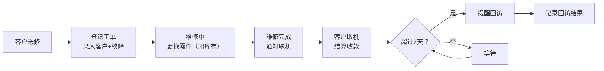

## 1. 产品概述

面向小型家电维修店的轻量级管理系统，解决客户信息记录、维修工单跟踪、零件库存管理和售后服务回访等核心业务问题。
- 目标用户：家电维修店店主及维修师傅
- 核心价值：简化日常操作流程，自动管理库存，提升客户服务质量

## 2. 核心功能

### 2.1 用户角色

| 角色 | 注册方式 | 核心权限 |
|------|----------|----------|
| 店主/员工 | 本地系统直接使用 | 全部功能权限 |

### 2.2 功能模块

1. **工作台首页**：今日工单概览、低库存提醒、快捷操作入口
2. **客户管理**：客户信息增删改查、查看客户维修历史
3. **维修工单**：工单登记、维修过程记录（更换零件）、结算收款、通知取机
4. **零件库存**：零件信息管理、库存自动扣减、低库存预警
5. **回访记录**：维修后一周回访、回访结果记录

### 2.3 页面详情

| 页面名称 | 模块名称 | 功能描述 |
|-----------|-------------|---------------------|
| 工作台首页 | 统计卡片 | 待修中工单数、今日完成数、低库存零件数 |
| 工作台首页 | 快捷入口 | 新建工单、新增客户、库存查询 |
| 工作台首页 | 低库存提醒 | 展示低于最低库存的零件列表，高亮提醒 |
| 客户管理 | 客户列表 | 展示所有客户，支持按姓名/电话搜索 |
| 客户管理 | 新增客户 | 录入客户姓名、电话、备注 |
| 客户管理 | 客户详情 | 查看客户信息、历史维修记录、回访记录 |
| 维修工单 | 工单列表 | 按状态（待修/维修中/待取/已完成）筛选 |
| 维修工单 | 新建工单 | 选择客户、录入电器品牌型号、故障现象 |
| 维修工单 | 维修记录 | 记录更换零件（从零件库选择，自动扣库存）、工时费 |
| 维修工单 | 结算取机 | 自动计算总费用（零件费+工时费）、标记已完成 |
| 零件库存 | 零件列表 | 展示所有零件库存，支持搜索分类 |
| 零件库存 | 新增/编辑零件 | 录入零件名称、分类、单价、当前库存、最低库存 |
| 回访记录 | 待回访列表 | 自动筛选完成超过7天未回访的工单 |
| 回访记录 | 回访操作 | 记录回访结果（正常/有问题）、回访备注 |

## 3. 核心流程

客户送修电器 → 登记客户信息和机器故障 → 维修过程中更换零件（库存自动扣减）→ 修好后通知客户取机 → 结算收款（零件费+工时费）→ 7天后自动提醒回访 → 记录回访结果

## 4. 用户界面设计

### 4.1 设计风格
- 主色调：工业蓝 #1e40af，辅助色：琥珀橙 #f59e0b（提醒/警告）
- 中性色：锌灰色系（zinc）作为背景和文字
- 按钮风格：圆角 8px，实心主按钮 + 浅色次按钮
- 字体：标题用"思源黑体/Noto Sans SC"，正文字体清晰易读
- 布局：左侧导航栏 + 右侧内容区的经典后台管理布局
- 图标：使用 Lucide 图标库，保持统一线性风格

### 4.2 页面设计概览

| 页面名称 | 模块名称 | UI 元素 |
|-----------|-------------|-------------|
| 工作台首页 | 统计卡片 | 渐变色背景卡片，大数字+图标，悬浮微动效 |
| 工作台首页 | 低库存提醒 | 琥珀色边框+图标警示，表格展示 |
| 客户/工单/零件列表 | 数据表格 | 斑马纹行，悬停高亮，圆角卡片容器 |
| 表单弹窗 | 新建/编辑表单 | 左侧标签，右侧输入，分组布局，底部操作按钮 |
| 工单详情 | 状态时间线 | 垂直时间线展示工单状态流转 |

### 4.3 响应式
桌面端优先设计，平板设备自适应。在 1024px 以下宽度时，侧边栏可折叠收起。

### 4.4 视觉细节
- 卡片使用微妙阴影和圆角，营造专业整洁感
- 状态标签使用不同颜色区分（待修-灰色、维修中-蓝色、待取-橙色、已完成-绿色）
- 低库存使用琥珀色背景+闪烁动画提醒
- 按钮和可交互元素有明显的 hover 状态变化
