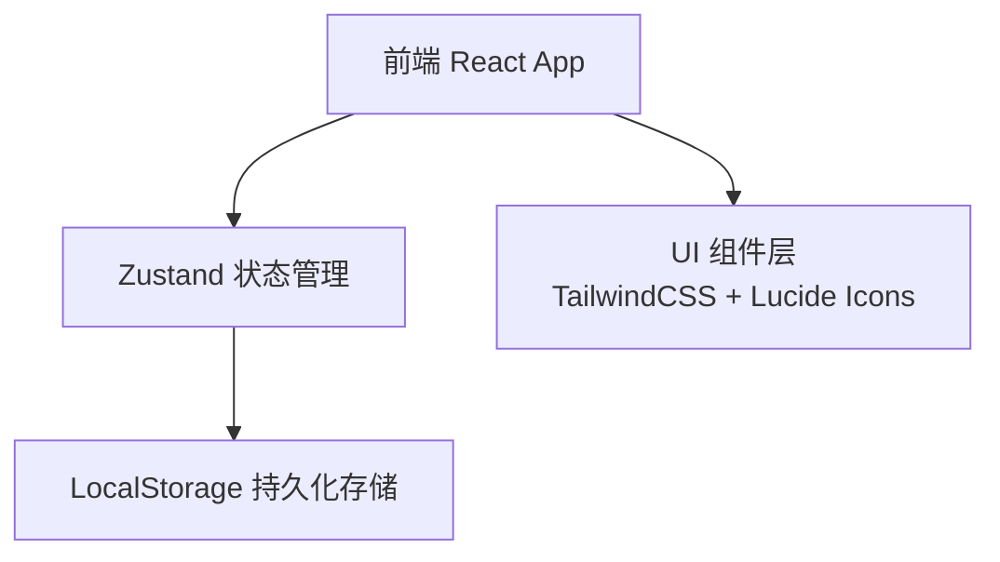
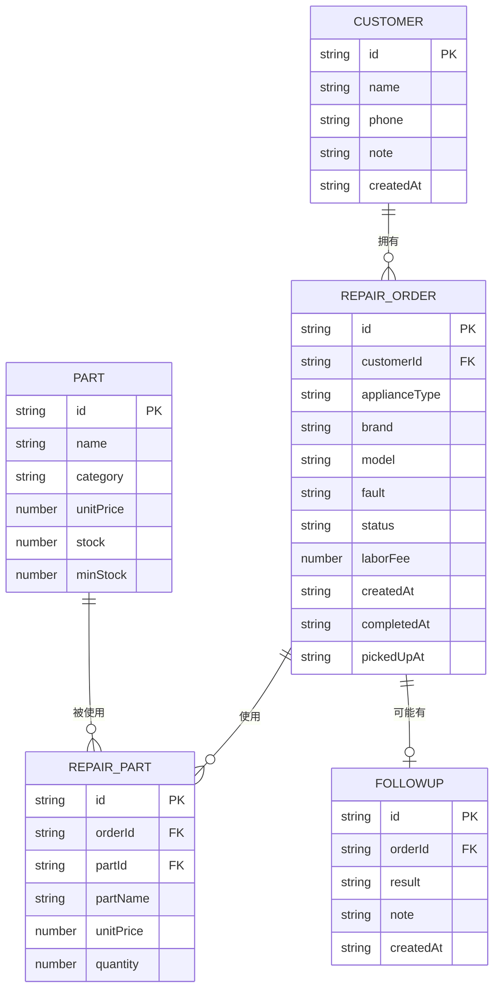

## 1. 架构设计



本项目为纯前端单页应用（SPA），使用浏览器 LocalStorage 进行数据持久化，无需后端服务。

## 2. 技术描述

- 前端：React@18 + TypeScript + Vite
- 样式：TailwindCSS@3
- 状态管理：Zustand
- 图标：Lucide React
- 数据存储：浏览器 LocalStorage
- 初始化工具：vite-init（react-ts 模板）

## 3. 路由定义

| 路由 | 用途 |
|-------|---------|
| /dashboard | 工作台首页 |
| /customers | 客户管理列表 |
| /customers/:id | 客户详情（含维修历史） |
| /orders | 维修工单列表 |
| /orders/:id | 工单详情（维修、结算） |
| /inventory | 零件库存管理 |
| /followups | 回访记录 |

## 4. 数据模型

### 4.1 数据模型定义



### 4.2 工单状态枚举

- `pending`：待修（已登记，尚未开始维修）
- `repairing`：维修中（正在维修处理）
- `ready`：待取（维修完成，等待客户取机）
- `completed`：已完成（客户已取机付款）

### 4.3 初始示例数据

```typescript
// 客户
[
  { id: "c1", name: "张三", phone: "13800138001", note: "", createdAt: "2026-06-10" },
  { id: "c2", name: "李四", phone: "13900139002", note: "老客户", createdAt: "2026-06-12" }
]

// 零件库存
[
  { id: "p1", name: "空调压缩机", category: "空调", unitPrice: 580, stock: 3, minStock: 2 },
  { id: "p2", name: "冰箱温控器", category: "冰箱", unitPrice: 45, stock: 10, minStock: 5 },
  { id: "p3", name: "电视电源板", category: "电视", unitPrice: 180, stock: 1, minStock: 2 },
  { id: "p4", name: "洗衣机皮带", category: "洗衣机", unitPrice: 25, stock: 20, minStock: 10 }
]
```

## 5. 项目目录结构

```
src/
├── components/          # 可复用组件
│   ├── Layout/         # 主布局（侧边栏+内容区）
│   ├── Modal/          # 通用弹窗
│   ├── StatusBadge/    # 状态标签
│   └── DataTable/      # 通用数据表格
├── pages/              # 页面组件
│   ├── Dashboard.tsx
│   ├── CustomerList.tsx
│   ├── CustomerDetail.tsx
│   ├── OrderList.tsx
│   ├── OrderDetail.tsx
│   ├── Inventory.tsx
│   └── Followups.tsx
├── store/              # Zustand 状态管理
│   └── index.ts
├── types/              # TypeScript 类型定义
│   └── index.ts
├── utils/              # 工具函数
│   ├── storage.ts      # LocalStorage 封装
│   └── date.ts         # 日期格式化
├── App.tsx
├── main.tsx
└── index.css
```
